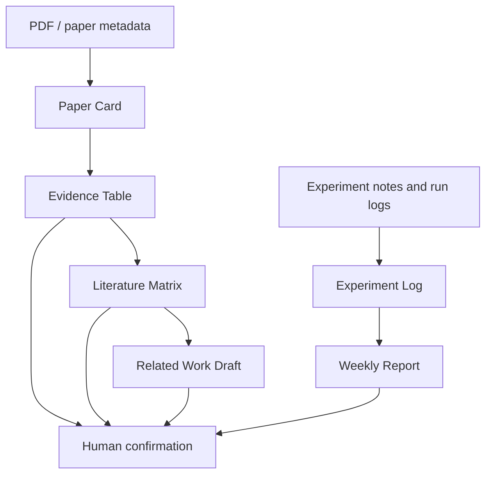

# ScholarPilot

ScholarPilot is a lab research assistant Agent built as a second-stage development fork of [OpenHarness](https://github.com/HKUDS/OpenHarness). It is designed for graduate students and researchers who need a traceable workflow for paper reading, literature organization, experiment notes, and research writing.

The project goal is not to hide its foundation. ScholarPilot reuses the OpenHarness agent runtime, tool system, skill loading, memory, permissions, and multi-agent coordination as its base, then adds research-oriented workflows on top: evidence tracking, paper cards, literature matrices, task logs, and human confirmation points.

> Current status: v0.3. ScholarPilot now includes two read-only OpenHarness tools: `paper_card_extractor` for conservative PDF-to-Paper-Card extraction and `evidence_table_extractor` for page-level source tracing. Both are rule-based MVPs; semantic accuracy and human approval are not assumed.

## Project Positioning

ScholarPilot turns common research work into an auditable intelligent task chain:

- Read and summarize papers without losing source context.
- Convert PDFs into structured Paper Cards.
- Trace extracted research fields back to page-level source text in Evidence Tables.
- Compare multiple papers in a Literature Matrix.
- Draft related work sections from evidence-backed notes.
- Record experiments and generate weekly research reports.
- Keep humans in the loop before writing, citing, or committing important outputs.

The intended users are:

- Graduate students managing a fast-growing reading list.
- Research assistants maintaining experiment logs and paper notes.
- Lab members preparing group meeting reports.
- Early-stage research projects that need lightweight agent-assisted workflows before building a full research platform.

## Core Features

ScholarPilot capabilities are organized around research artifacts rather than generic chat:

| Area | Artifact | Status | Purpose |
| --- | --- | --- | --- |
| Paper reading | Paper Card | v0.2 MVP | Extract fixed fields from local PDFs without filling missing content. |
| Evidence tracking | Evidence Table | v0.3 MVP | Trace populated Paper Card fields to PDF pages, sections, and source snippets. |
| Literature review | Literature Matrix | Planned | Compare papers by research question, method, dataset, metric, contribution, and weakness. |
| Writing support | Related Work Draft | Planned | Generate a first-pass related work section from verified evidence. |
| Experiment management | Experiment Log | Planned | Record setup, hypotheses, parameters, results, failures, and next actions. |
| Reporting | Weekly Report | Planned | Summarize progress, blockers, readings, experiments, and next-week plans. |
| Governance | Human confirmation | Partial | Evidence rows carry a pending-review state; interactive approval remains planned. |

## Research Workflow

The workflow is designed to preserve traceability. A generated summary should be explainable through the intermediate artifacts that produced it.

## Current MVP Scope

The implemented ScholarPilot layer currently covers:

- v0.1: project positioning, architecture, workflow, roadmap, and coding-agent rules.
- v0.2: local PDF parsing with `pypdf` and fixed-schema Paper Card JSON.
- v0.3: Evidence Table rows with page number, section, source quote, confidence, trace status, and pending human-review status.

The extractors use metadata and conservative section-heading rules. They do not call an LLM, guarantee semantic extraction accuracy, inspect figures or tables, or invent values that cannot be found.

## Based on OpenHarness

ScholarPilot is a derivative project based on OpenHarness. OpenHarness provides the lower-level agent harness:

- Agent loop and streaming model interaction.
- Tool calling and permission checks.
- Skill and plugin loading.
- Memory and session primitives.
- Multi-agent and background task coordination.
- CLI/TUI runtime infrastructure.

ScholarPilot will build research-specific behavior on top of those primitives. It should not present itself as a from-scratch agent framework.

Important retained files and directories:

- `LICENSE`: original license remains in place.
- `src/openharness/`: upstream runtime foundation.
- `ohmo/`: upstream personal-agent app still present.
- `tests/`: upstream tests still validate the inherited runtime.
- `docs/`: ScholarPilot-specific docs will be added alongside legacy OpenHarness material during the transition.

## Roadmap

See [`ROADMAP.md`](ROADMAP.md) for the full roadmap.

High-level milestones:

- v0.1: project positioning and documentation (complete).
- v0.2: PDF import and Paper Card (MVP complete).
- v0.3: Evidence Table with source traceability (MVP complete).
- v0.4: Literature Matrix for multi-paper comparison.
- v0.5: Related Work Draft generation.
- v0.6: Experiment Log and Weekly Report.

## Demo Plan

The first public demo should be small and reproducible:

1. Import one research paper PDF.
2. Generate a Paper Card with metadata, problem, method, results, and limitations.
3. Extract 5 to 10 evidence rows with page references.
4. Add two more papers and build a Literature Matrix.
5. Generate a short related work draft from the matrix.
6. Record one experiment note and produce a weekly report snippet.

Demo quality bar:

- Every claim should link back to an evidence row or user-provided note.
- The demo should show human confirmation before producing citation-sensitive text.
- The output should be easy for a reviewer or interviewer to inspect in under five minutes.

## Documentation

- [`ROADMAP.md`](ROADMAP.md): staged product roadmap.
- [`TODO.md`](TODO.md): current and future tasks.
- [`AGENTS.md`](AGENTS.md): rules for AI coding agents working in this repository.
- [`docs/architecture.md`](docs/architecture.md): architecture direction and OpenHarness relationship.
- [`docs/research-workflow.md`](docs/research-workflow.md): end-to-end research workflow design.

## Development Notes

This repository currently keeps the OpenHarness package name, commands, Agent Loop, Provider layer, Multi-Agent runtime, and TUI layout. ScholarPilot functionality is being added through the inherited Tool registry rather than by presenting a new framework as original infrastructure.

Future code changes should be small, testable, and explicit about whether they are:

- preserving upstream OpenHarness behavior,
- adapting OpenHarness behavior for ScholarPilot,
- or adding a new ScholarPilot research workflow layer.

## License

This project retains the original OpenHarness license. See [`LICENSE`](LICENSE).
