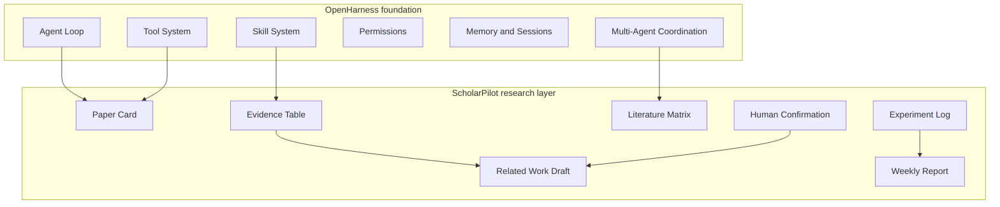
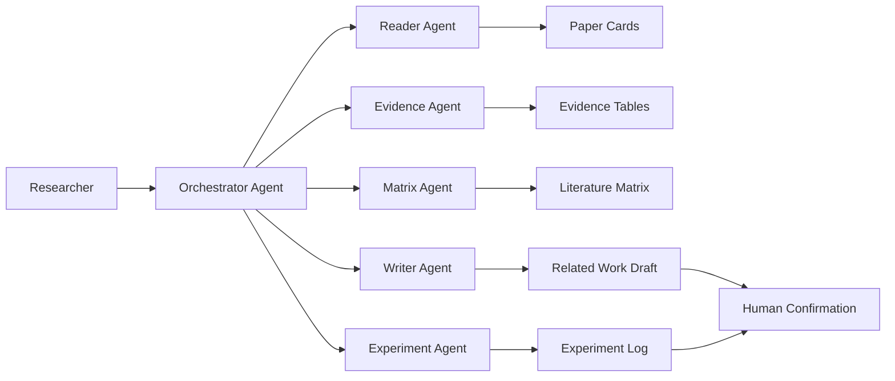

# ScholarPilot Architecture

ScholarPilot is a research assistant layer built on top of OpenHarness. The architecture keeps OpenHarness as the agent harness foundation and adds research-specific artifacts, workflows, and confirmation points.

## Relationship to OpenHarness

OpenHarness provides the inherited runtime:

- Agent loop.
- Tool registry and tool execution.
- Skill loading.
- Permission checks.
- Memory and session primitives.
- Multi-agent coordination.
- CLI and TUI infrastructure.

ScholarPilot adds a research workflow layer:

- Paper Card generation.
- Evidence Table extraction.
- Literature Matrix comparison.
- Related Work Draft generation.
- Experiment Log and Weekly Report workflows.
- Human confirmation around citation-sensitive or irreversible actions.

This split is intentional. ScholarPilot should reuse OpenHarness where possible instead of duplicating harness infrastructure.

## Agent Loop

ScholarPilot uses the OpenHarness agent loop as the execution backbone:

1. Receive a research task from the user.
2. Build context from project files, prior notes, and selected research artifacts.
3. Ask the model to choose the next action.
4. Execute tools through the OpenHarness tool system.
5. Record outputs as structured artifacts or task log entries.
6. Ask for human confirmation when evidence, citation, or task state is uncertain.
7. Continue until the requested artifact is complete or blocked.

For research workflows, the loop should favor traceability over speed. A shorter answer is less useful if it cannot explain where its claims came from.

## Tool System

OpenHarness already provides tool calling, validation, permissions, and execution results. ScholarPilot should add research tools only when the generic tools are not enough.

Implemented research tools:

- `paper_card_extractor`: parses local PDFs and returns a fixed Paper Card JSON object.
- `evidence_table_extractor`: maps populated Paper Card fields back to extracted page text.
- `literature_matrix_builder`: aligns multiple Evidence Tables without semantic inference.
- `related_work_draft_builder`: drafts only from explicitly approved, source-located matrix evidence.
- `experiment_log_builder`: normalizes user-supplied experiment records and research links.
- `weekly_report_builder`: aggregates supplied research records into strict JSON and Markdown.

Expected future research tools:

- Persistent artifact writer and updater.
- OpenHarness task-log adapter.

Every research tool should return structured output that can be reviewed, saved, and reused.

## Skill System

OpenHarness skills are Markdown-based instructions loaded on demand. ScholarPilot can use this system for domain workflows.

Expected future skills:

- Paper reading.
- Evidence extraction.
- Literature review synthesis.
- Related work drafting.
- Experiment logging.
- Weekly report writing.

Skills should describe workflow rules, artifact schemas, and quality checks. They should not claim authority over evidence that is not present in the source material.

## Evidence Tracking

Evidence Tracking is the core ScholarPilot layer. It prevents research writing from becoming unsupported paraphrase.

An evidence row should track:

- Paper identifier.
- Claim or observation.
- Source location, such as page, section, figure, table, or quote.
- Evidence type.
- Confidence.
- Whether the row is direct evidence or model inference.
- Human review status.

Evidence rows should feed later artifacts. Related Work Drafts should cite or reference only confirmed evidence unless explicitly marked as tentative.

The v0.3 MVP records page number, normalized section, extracted source quote, match confidence, trace status, and `pending_human_review`. It does not yet identify figure or table coordinates, split sections into semantic claims, or mark evidence as human-confirmed.

## Task Log

The Task Log records research work as a sequence of decisions and artifacts.

It should capture:

- User request.
- Agent actions.
- Tools used.
- Artifacts created or updated.
- Human confirmations.
- Open questions.
- Next actions.

The log is useful for weekly reports, lab meetings, and recovering context across sessions.

## Multi-Agent Workflow

OpenHarness includes multi-agent coordination primitives. ScholarPilot can map them to specialized research roles.

Possible roles:

- Reader Agent: extracts Paper Cards from individual papers.
- Evidence Agent: builds and checks Evidence Tables.
- Matrix Agent: compares papers across dimensions.
- Writer Agent: drafts related work from confirmed evidence.
- Experiment Agent: records experiment logs and report entries.
- Reviewer Agent: checks whether claims are supported.

The orchestrator should keep final responsibility for scope, artifact consistency, and user confirmation.
